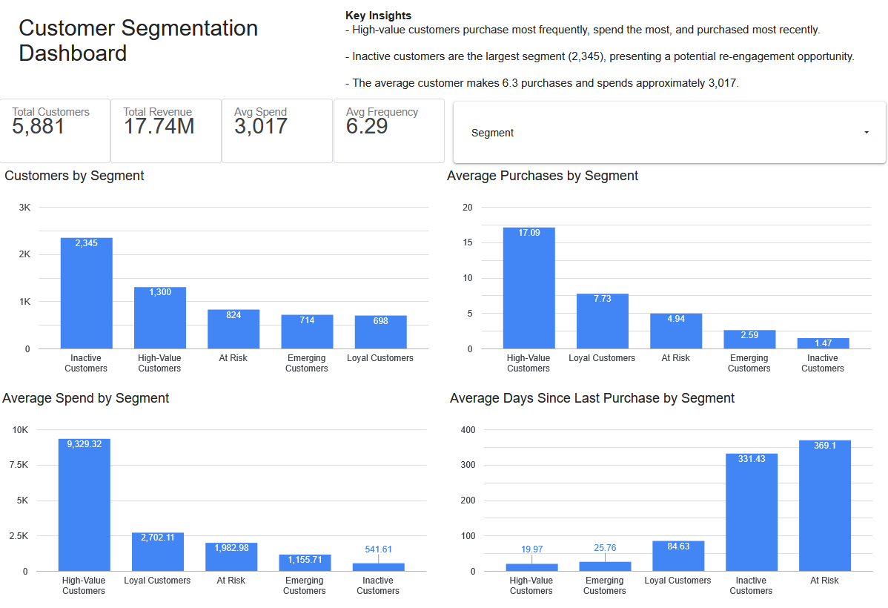

## Project Overview
I used Python to clean and analyze retail transaction data, then used RFM analysis to group customers based on their purchasing behavior. I used the results to build an interactive customer segmentation dashboard in Looker Studio and identify key insights about each customer group and how to best reach them.

The goal of this project was to analyze the retail dataset to better understand how loyal and active the customers are. I used RFM analysis to look at customer purchasing behavior and group customers into different segments based on their activity and value.

## Tools Used

- **Python** – Used to clean, prepare, and analyze the retail transaction data.
- **Jupyter Notebook** – Used to perform the data cleaning, RFM analysis, and create visualizations.
- **Pandas** – Used to manipulate and analyze the dataset.
- **Looker Studio** – Used to build the interactive Customer Segmentation Dashboard.
- **Excel** – Used to work with and review the project data.

## Dashboard

## Key Business Insights

### 1. A large proportion of customers are inactive
2,345 of the 5,881 customers were classified as Inactive Customers. This suggests an opportunity to improve customer retention through re-engagement campaigns.

### 2. High-Value Customers drive significant business value
1,300 customers were classified as High-Value Customers. Retaining these customers should be a priority through loyalty programs and personalized offers.

### 3. At-Risk Customers present a recovery opportunity
824 customers were classified as At-Risk. These customers previously showed valuable purchasing behavior but have not purchased recently, making them potential targets for promotions or reminder campaigns.

### 4. Emerging Customers have growth potential
714 customers were classified as Emerging Customers. These customers have started engaging with the business and could potentially develop into more loyal customers with effective marketing.

### 5. Loyal Customers provide consistent value
Although smaller in number, Loyal Customers make repeat purchases and contribute to the business through continued engagement.

## Key Takeaways

- Customer activity and value vary significantly across the different customer segments.
- The large number of inactive customers highlights an opportunity to focus on customer retention and re-engagement.
- RFM analysis helped identify which customers may be worth retaining, re-engaging, or developing further.
- The dashboard makes it easier to compare customer segments and turn the analysis into actionable business insights.
